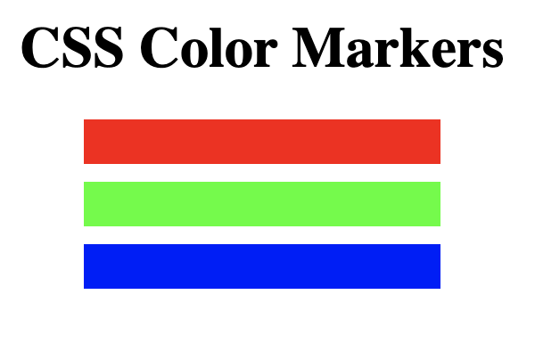
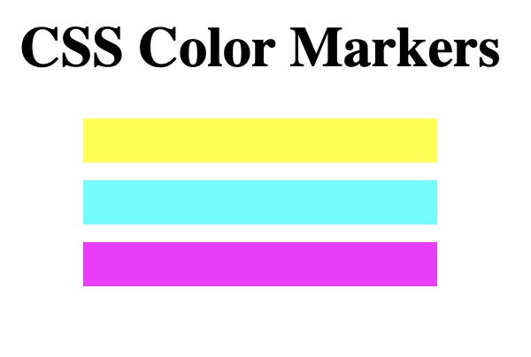
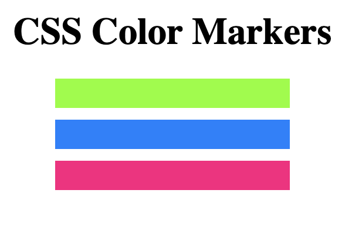
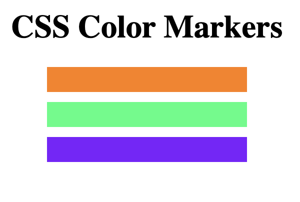

# MarkerSet
This Project is from FreeCodeCamp, used to learn about CSS colors and how to use them. 

## Notes
- when margin property in CSS has two values, the first value is for vertical, second is for horizontal. 
- multiple classes can be given to elements, just put space between. When styling, the styles of the first class may be overridden by later classes. 
- rgb function in css allows you to choose values of rgb for color
- Primary colors are colors when combined makes pure white (rgb)
- Secondary colors are combination of primary colors (cym)
- Tertiary colors are combination of primary and secondary

## Colors
### Primary Colors:

1. (255,0,0) - red
2. (0,255,0) - blue
3. (0,0,255) - green

### Secondary Colors: 

1. (255,255,0) - red + green (Yellow)
2. (0,255,255) - green + blue (Cyan)
3. (255,0,255) - red + blue (Magenta)

### Tertiary Colors: 
 

1. (127,255,0) - yellow + green (chartreuse green)
2. (0,127,255) - cyan + blue (azure)
3. (255,0,127) - magenta + red (rose)
4. (255,127,0) - yellow + red (orange)
5. (0,255,127) - cyan + green (spring green)
6. (127,0,255) - magenta + blue (violet)
