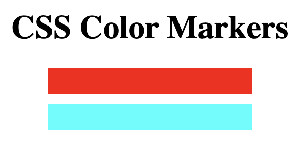

# MarkerSet
This Project is from FreeCodeCamp, used to learn about CSS colors and how to use them. 

## Notes
- when margin property in CSS has two values, the first value is for vertical, second is for horizontal. 
- multiple classes can be given to elements, just put space between. When styling, the styles of the first class may be overridden by later classes. 
- rgb function in css allows you to choose values of rgb for color
- **Primary colors** are colors when combined makes pure white (rgb)
- **Secondary colors** are combination of primary colors (cym)
- **Tertiary colors** are combination of primary and secondary
- **Complementary colors** combine to make gray. Side by side, they contrast to make other seem brighter
    - this can be used to draw user attention

- another way to represent color is with **hexdecimal**. Basically the same as rgb, where each value is represented with two base-16 value, where FF is max, 00 is min. 
- another way to represent color is with **hsl(hue, saturation, lightness)** where hue is degree on color wheel (0 = red, 120 = green, 240 = blue), saturation is intensity of color (0 = grey, 100 = pure), lightness is how bright the color is (0 = black, 100 = white). 
- another way to represent color is with **rgba**, which is the same as rgb but with extra alpha value representing opacity.

- You can set gradient color with the **linear-grandient(gradientDirection, color1, color2, ...)** function. It is usually paired with the **background:** paramenter. 
    - you can the percentage of gradient by adding a percentage beside the color
    - gradient is set to 180 by default

## Colors
### Primary Colors:

1. (255,0,0) - red
2. (0,255,0) - blue
3. (0,0,255) - green

### Secondary Colors: 

1. (255,255,0) - red + green (Yellow)
2. (0,255,255) - green + blue (Cyan)
3. (255,0,255) - red + blue (Magenta)

### Tertiary Colors: 
 

1. (127,255,0) - yellow + green (chartreuse green)
2. (0,127,255) - cyan + blue (azure)
3. (255,0,127) - magenta + red (rose)
4. (255,127,0) - yellow + red (orange)
5. (0,255,127) - cyan + green (spring green)
6. (127,0,255) - magenta + blue (violet)

### Complementary Colors: 

- Cyan and red combine to make white (shade of grey)